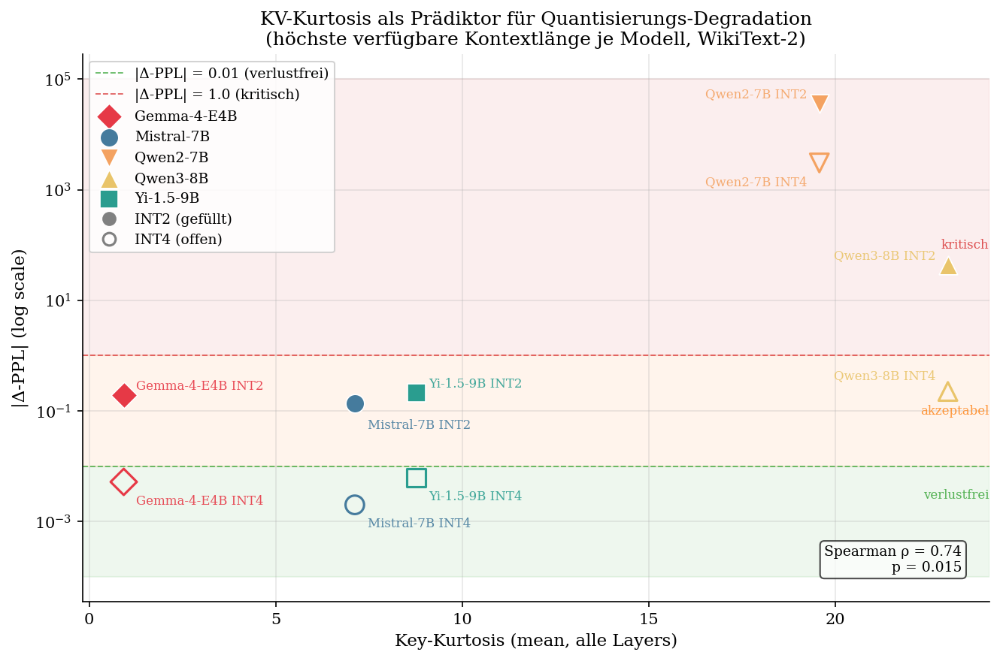
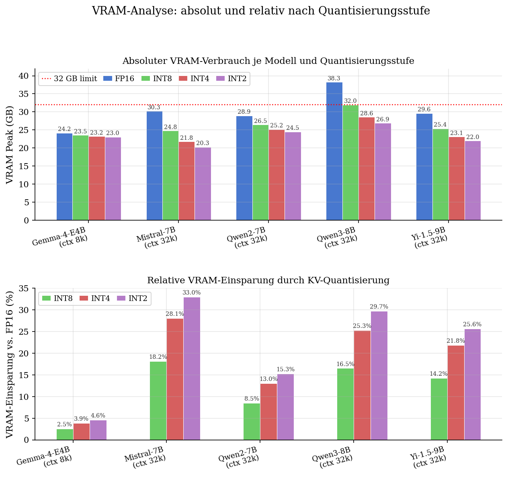
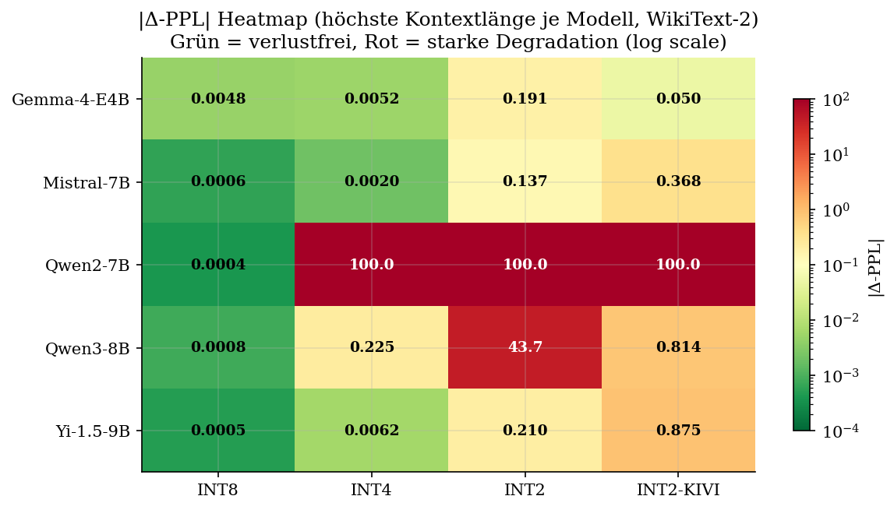
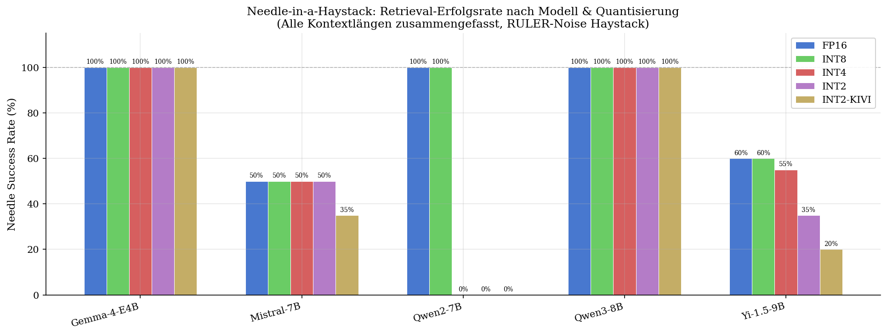
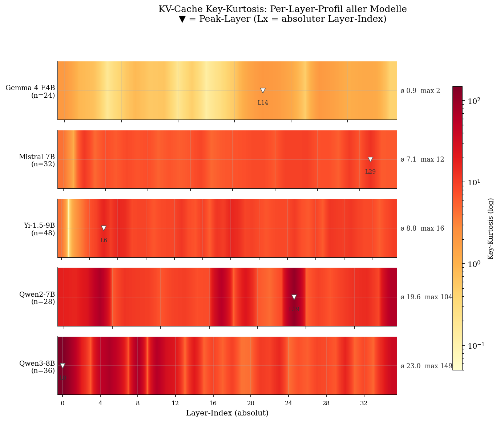
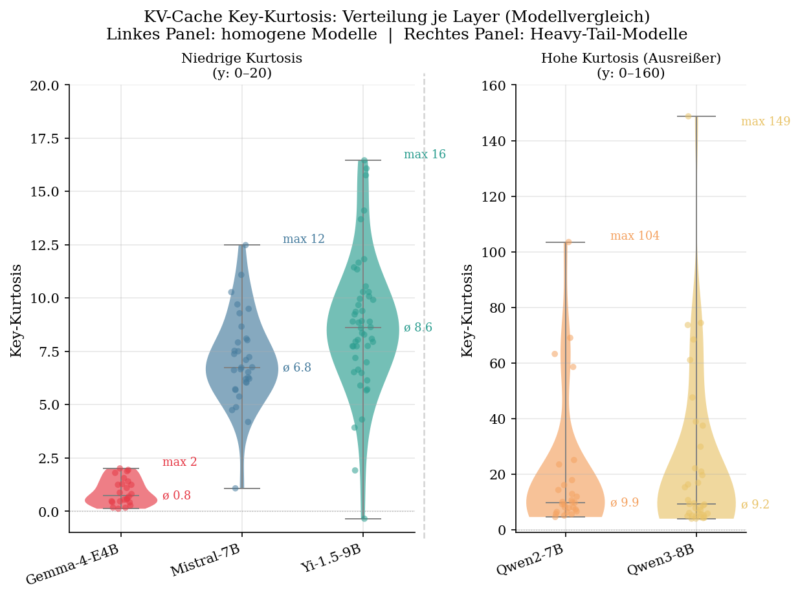
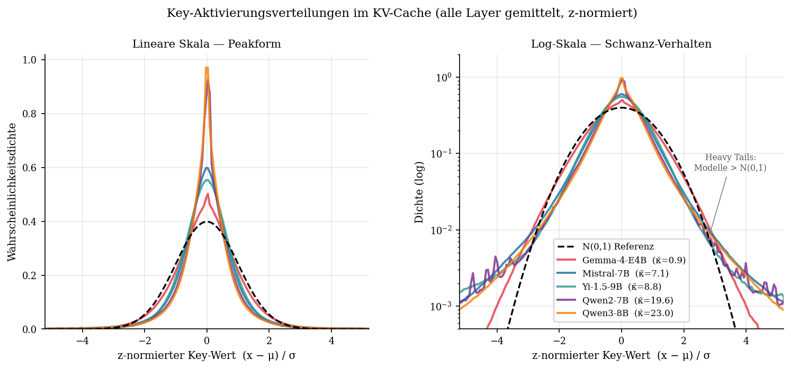

# Abbildungsbeschriftungen — MA-Thesis: KV-Cache-Quantisierung

Alle Abbildungen wurden aus den Profiling-Ergebnissen der Phase-B-Messung
(5 Modelle, WikiText-2-Perplexität, RULER Needle-in-a-Haystack) sowie der
KV-Verteilungsanalyse (je Modell 1 Forward-Pass bei 4 096 Tokens) generiert.
Hardware: NVIDIA RTX 5090 (32 GB GDDR7), PyTorch 2.8, Transformers 4.57.

---

## Abbildung 1 — KV-Kurtosis als Prädiktor für Quantisierungs-Degradation

**Abbildungsbeschriftung:**  
Streudiagramm des absoluten Perplexitätsverlustes |Δ-PPL| (WikiText-2,
höchste verfügbare Kontextlänge je Modell) über der mittleren Key-Kurtosis
aller Transformer-Layer. Gefüllte Marker = INT2-HQQ, offene Marker = INT4-HQQ.
Die horizontalen Trennlinien bei |Δ-PPL| = 0,01 (grün, »verlustfrei«) und
|Δ-PPL| = 1,0 (rot, »kritisch«) markieren praxisrelevante Schwellenwerte.
Spearman ρ und p-Wert sind im Plot annotiert.

**Befund:**  
Es besteht eine starke positive Rangkorrelation zwischen Key-Kurtosis und
Quantisierungs-Degradation (Spearman ρ ≈ 0,74, p = 0,015). Modelle mit
nahezu normalverteilten Key-Tensoren (Gemma-4-E4B, Kurtosis ≈ 0,9) bleiben
auch bei 2-Bit-Quantisierung praktisch verlustfrei, während Modelle mit
stark leptokurtischen Schlüsseltensoren (Qwen2-7B, Kurtosis ≈ 19,6; Qwen3-8B,
≈ 23,0) selbst bei INT4 deutliche Degradation zeigen. Die Kurtosis der
Key-Tensoren eignet sich damit als einfacher, modellarchitektur-unabhängiger
Prädiktor für die Quantisierungsresilienz.

---

## Abbildung 2 — VRAM-Verbrauch nach Modell und Quantisierungsstufe

**Abbildungsbeschriftung:**  
Oben: Absoluter VRAM-Peak in GB bei der höchsten verfügbaren Kontextlänge je
Modell (Gemma-4-E4B: 8 192 Tokens; alle anderen: 32 768 Tokens). Die rote
gestrichelte Linie markiert die physische VRAM-Grenze der Testhard­ware
(32 GB). Unten: Relative VRAM-Einsparung gegenüber FP16-Baseline in Prozent.

**Befund:**  
Der KV-Cache selbst skaliert nahezu exakt wie theoretisch erwartet: INT8
halbiert, INT4 viertelt, INT2 achtelt den Speicherbedarf gegenüber FP16.
Die gemessenen Werte für Gemma ctx=8192 belegen dies — FP16: 448 MB,
INT8: 238 MB (×0,53), INT4: 126 MB (×0,28), INT2: 70 MB (×0,16).
Die leichte Abweichung vom theoretischen Faktor entsteht durch zwei Mechanismen:
(1) HQQ speichert pro Quantisierungsgruppe Skalierungsfaktoren und Zero-Points als
Metadaten, (2) die letzten 128 Tokens je Layer verbleiben als *Residual Buffer*
immer in FP16, da die jüngsten Tokens am häufigsten in der Attention genutzt werden
und Quantisierungsfehler dort direkt die Ausgabequalität beeinflussen würden.
Der übrige quantisierte Cache bleibt dauerhaft komprimiert im VRAM; für jede
Attention-Operation wird on-the-fly in FP16 dequantisiert, die temporäre Kopie
nach der Berechnung sofort verworfen.

Trotz der linearen KV-Cache-Skalierung sind die Gesamt-VRAM-Einsparungen deutlich
geringer, da die Modellgewichte (~16 GB, dauerhaft in FP16) den dominanten VRAM-Block
bilden. Die tatsächlichen Einsparungen sind daher stark modellabhängig und skalieren
mit dem Verhältnis KV-Cache zu Gesamtspeicher. Gemma-4-E4B
profitiert kaum: INT2 spart lediglich 4,6 % (24,2 → 23,0 GB), da der
KV-Cache bei 8 192 Tokens nur ~1,9 % des Gesamt-VRAM ausmacht.
Mistral-7B hingegen zeigt bei 32k Tokens ausgeprägte Einsparungen:
INT8 −18 %, INT4 −28 %, INT2 −33 % (30,3 → 20,3 GB). Ähnlich starke Effekte
zeigen Yi-1.5-9B (INT2: −26 %) und Qwen3-8B (INT2: −30 %). Qwen3-8B
überschreitet bei FP16 und 32k Tokens die 32-GB-Grenze der Testhardware
(38,3 GB); erst ab INT8 ist ein stabiler Betrieb ohne PCIe-Überlauf möglich.
Die Varianz der Einsparungen unterstreicht, dass die Kontextlänge den
KV-Cache-Anteil am VRAM maßgeblich bestimmt — bei kurzen Kontexten dominieren
die Modellgewichte, bei langen Kontexten der Cache.

---

## Abbildung 3 — |Δ-PPL|-Heatmap: Modell × Quantisierungsstufe

**Abbildungsbeschriftung:**  
Heatmap des absoluten Perplexitätsverlustes |Δ-PPL| (WikiText-2) für alle
fünf Modelle und vier Quantisierungsstufen (INT8-HQQ, INT4-HQQ, INT2-HQQ,
INT2-HQQ-KIVI) bei der höchsten verfügbaren Kontextlänge je Modell.
Farbskala: logarithmisch normiert, RdYlGn_r (Grün = gering, Rot = hoch).
Zellbeschriftungen zeigen den numerischen |Δ-PPL|-Wert.

**Befund:**  
Die Heatmap macht die modellspezifischen Resilienzunterschiede auf einen
Blick sichtbar. Gemma-4-E4B und Mistral-7B zeigen in der gesamten INT8-
und INT4-Spalte grüne Zellen (|Δ-PPL| < 0,01). Qwen2-7B und Qwen3-8B
erzeugen bereits bei INT4 orange bis rote Werte. Bei INT2 kollabiert
Qwen2-7B mit |Δ-PPL| > 3 000 vollständig. KIVI-Quantisierung schneidet
für alle Modelle schlechter ab als HQQ bei gleicher Bitbreite.

---

## Abbildung 4 — Needle-in-a-Haystack: Retrieval-Erfolgsrate

**Abbildungsbeschriftung:**  
Erfolgsrate (%) des Needle-in-a-Haystack-Retrieval-Tests (RULER-Rauschen,
20 Proben je Konfiguration) für alle Modell-Quantisierungs-Kombinationen.
Getestet bei der höchsten verfügbaren Kontextlänge je Modell.

**Befund:**  
Die Needle-Ergebnisse korrelieren nur teilweise mit der PPL-Degradation.
Qwen2-7B erzielt mit FP16 bereits 0 % (außerhalb des trainierten Kontextfensters),
was auf ein fundamentales Generalisierungsproblem hinweist, das durch
Quantisierung nicht verursacht wird. Yi-1.5-9B erreicht bei seinem
maximalen Trainings-Kontextfenster (4 096 Tokens) 100 %, versagt aber
ab 8 192 Tokens. Gemma-4-E4B und Qwen3-8B erreichen 100 % in allen
Quantisierungsstufen, was die hohe Qualitätssicherung dieser Modelle
im Long-Context-Bereich unterstreicht.

---

## Abbildung 5 — Key-Kurtosis-Heatmap: Per-Layer-Profil

**Abbildungsbeschriftung:**  
Heatmap der Key-Kurtosis (excess kurtosis, log-Farbskala) über die
normierte Layer-Position (0 % = erste, 100 % = letzte Transformer-Schicht)
für alle fünf Modelle. Modelle sind nach aufsteigender mittlerer Kurtosis
sortiert. Das ▼-Symbol markiert den Layer mit der höchsten Kurtosis je
Modell. Rechts jeder Zeile: mittlere (ø) und maximale Key-Kurtosis.

**Befund:**  
Gemma-4-E4B zeigt über alle Layer eine gleichmäßig helle Färbung (Kurtosis
≈ 0,1–2,0), was einer nahezu normalverteilten Schlüsselverteilung entspricht.
Qwen2-7B und Qwen3-8B weisen dagegen starke »Hot Spots« in mittleren Layern
auf (Spitzenwerte bis 149), die auf attention-sink-artige Konzentrations­muster
in bestimmten Köpfen hinweisen. Mistral-7B und Yi-1.5-9B nehmen eine mittlere
Position ein mit moderaten, aber klar erkennbaren Ausreißer-Layern.

---

## Abbildung 6 — Key-Kurtosis-Violin: Modellvergleich

**Abbildungsbeschriftung:**  
Violin-Plots der Key-Kurtosis-Verteilung über alle Layer, aufgeteilt in zwei
Gruppen mit unterschiedlichen y-Achsen. Linkes Panel (y: 0–20): Modelle mit
homogener Kurtosis (Gemma-4-E4B, Mistral-7B, Yi-1.5-9B). Rechtes Panel
(y: 0–160): Heavy-Tail-Modelle (Qwen2-7B, Qwen3-8B). Einzelne Layer-Punkte
sind mit Jitter-Streuung überlagert. Median (ø) und Maximum (max) sind
je Violin annotiert.

**Was bedeutet Key-Kurtosis praktisch?**  
Die Excess-Kurtosis misst, wie stark die Ausläufer einer Verteilung
(die sog. *Tails*) gegenüber einer Normalverteilung (Kurtosis = 0)
ausgeprägt sind — je höher der Wert, desto mehr Extremwerte (Ausreißer)
enthält der Tensor. Für KV-Cache-Quantisierung
ist das entscheidend: Ein Key-Tensor mit wenigen, aber sehr großen Ausreißern
zwingt das Quantisierungsgitter dazu, die gesamte Werterange abzudecken.
Dadurch wird die effektive Auflösung für die große Mehrheit der „normalen"
Werte stark reduziert, was zu größerem Rundungsfehler und damit zu
Perplexitätsanstieg führt. Hohe Kurtosis in einem Layer ist damit ein
direktes Signal: *dieser Layer ist quantisierungskritisch*. In der Praxis
würde ein Mixed-Precision-Schema genau diese Schichten mit mehr Bits
belegen — während Schichten mit geringer Kurtosis bedenkenlos auf 2 Bit
reduziert werden können.

**Befund:**  
Das linke Panel zeigt drei qualitativ unterschiedliche Verteilungsformen:
Gemma-4-E4B ist extrem kompakt (ø 0,8, max 2), Mistral-7B und Yi-1.5-9B
weisen breitere Violinen mit moderaten Ausreißern auf (max 12 bzw. 16).
Im rechten Panel sind die Qwen-Modelle trotz ähnlicher mittlerer Kurtosis
(ø 9–10) strukturell verschieden — Qwen3-8B hat mehr Ausreißer-Layer über
50. Die Aufteilung in zwei Panels mit explizit unterschiedlichen y-Achsen
ist notwendig, da Qwen2 und Qwen3 die für die anderen Modelle relevante
Anzeigeregion um den Faktor 8–10 überschreiten würden.

---

## Abbildung 7 — Key-Aktivierungsverteilungen: Normalverteilungsvergleich

**Abbildungsbeschriftung:**  
Gemittelte empirische Dichtefunktion der z-normierten Key-Aktivierungswerte
im KV-Cache, über alle Layer je Modell gemittelt (1 Forward-Pass, WikiText-2,
4 096 Tokens, 200 Bins in [−6, 6]). Die gestrichelte schwarze Kurve zeigt
die theoretische Normalverteilung N(0,1) als Referenz.
Linkes Panel: lineare Dichteskala — sichtbar ist die Peakschärfe.
Rechtes Panel: logarithmische Dichteskala — sichtbar ist die Randbesetzung
bei großen z-Werten (|z| > 2).

**Was zeigt die Log-Skala?**  
Auf der linearen Skala erscheinen alle Modelle ähnlich: der Peak liegt nahe
z = 0, die Kurven überlagern sich stark. Erst die Log-Skala trennt die
Modelle klar: Eine echte Normalverteilung fällt als Parabel ab
(d. h. die Dichte nimmt quadratisch mit zunehmendem |z| ab). Modelle
mit hoher Kurtosis liegen bei |z| ≈ 3–5 *über* der gestrichelten Referenz —
in den Extremwertbereichen ist mehr Masse konzentriert als bei N(0,1).
Diese seltenen, aber sehr großen Aktivierungswerte zwingen das
Quantisierungsgitter, einen weit größeren Wertebereich abzudecken, und
reduzieren so die Auflösung für die kompakte Masse nahe z = 0.

**Befund:**  
Gemma-4-E4B (rot) folgt der Gaußglocke am nächsten — sowohl im Peak (linkes
Panel: breites, flaches Profil nahe N(0,1)) als auch in den Extremwertbereichen
(rechtes Panel: Kurve bleibt nahe an der gestrichelten Parabel bis |z| ≈ 4).
Alle anderen Modelle zeigen schärfere Peaks und stärker besetzte Extrembereiche:
Mistral-7B und Yi-1.5-9B liegen moderat über der Referenz, Qwen2-7B
(violett) und Qwen3-8B (orange) weichen am stärksten ab — ihre Kurven
liegen im rechten Panel bei z = 3 um mehr als eine Größenordnung über der
Gaußreferenz.

Der Befund für Gemma-4-E4B ist dabei zweischneidig: Die annähernd
gaußförmige Werteverteilung führt zwar dazu, dass Quantisierung keine
messbare Qualitätsverschlechterung verursacht (|Δ-PPL| < 0,001 selbst bei
INT2). Gleichzeitig ist der KV-Cache-Anteil am Gesamt-VRAM bei ctx=8 192
so gering (~1,9 %), dass auch die erreichbare Speichereinsparung minimal
bleibt (INT2 spart absolut nur ~1,2 GB). Quantisierung hat bei Gemma-4-E4B
in dieser Konfiguration kaum Wirkung — weder positiv noch negativ. Das
Modell steht damit exemplarisch für die Grenzen von KV-Cache-Quantisierung
bei kompakten Architekturen mit kurzen Kontextfenstern, während die Methode
bei langkontextigem Betrieb (Mistral-7B, Qwen3-8B) ihren eigentlichen Nutzen
entfaltet.
